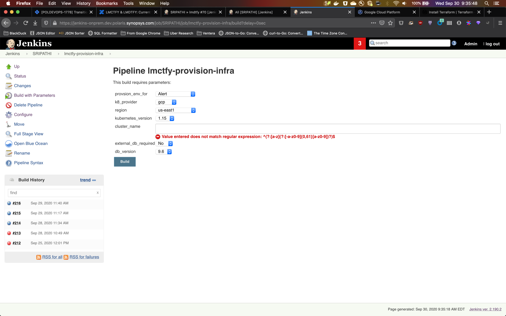
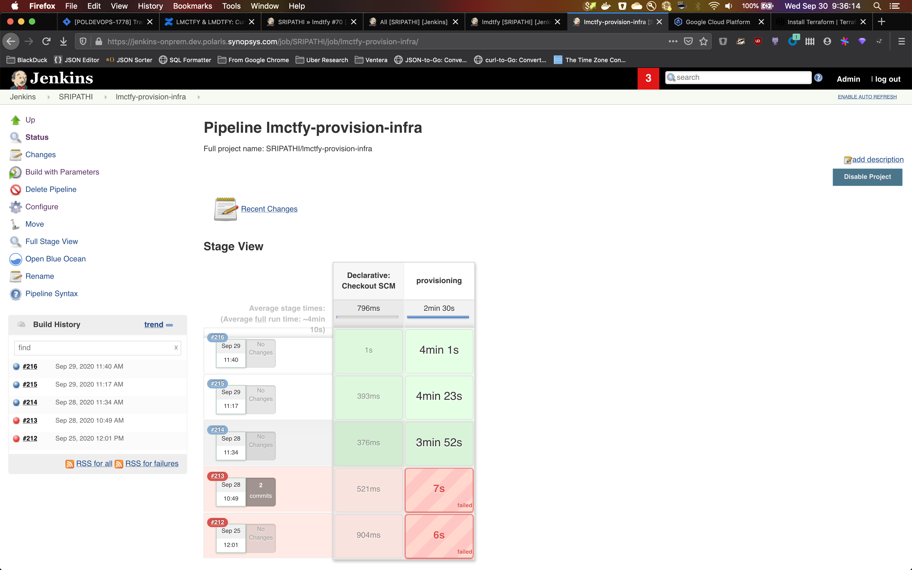
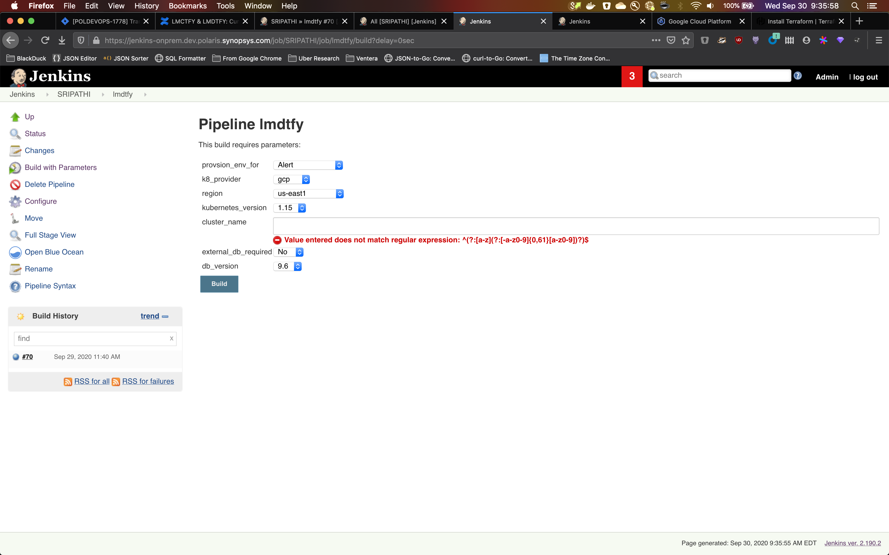
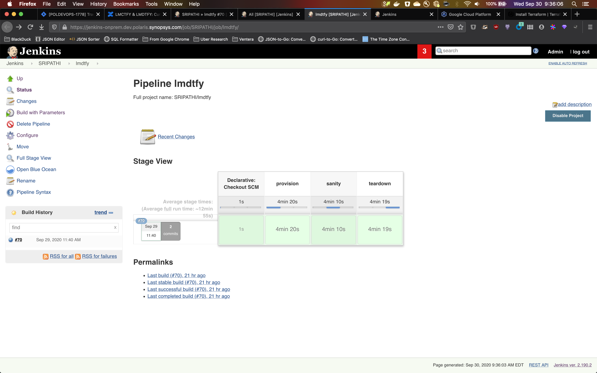

<!-- omit in toc -->
# let-me-cluster-that-for-you

Infrastructure as code turned into simple declarative APIs to create clusters on different clouds with sane defaults.

<!-- omit in toc -->
## Table of Contents

- [Running from within jenkins](#running-from-within-jenkins)
- [Google Cloud](#google-cloud)
  - [GKE cluster w/ private CloudSQL](#gke-cluster-w-private-cloudsql)
    - [Running from source](#running-from-source)
- [AWS](#aws)
  - [EKS with private RDS](#eks-with-private-rds)
    - [Running from source](#running-from-source-1)
- [Azure](#azure)
  - [AKS with private Azure DB](#aks-with-private-azure-db)
    - [Running from source](#running-from-source-2)

## Running from within jenkins

This repo provides reference, opinionated jenkins jobs for demonstrating and using the underlying workflows.  Check out [lmctfy.groovy](./new-implementation/lmctfy.groovy) for provisioning, its complementary [lmctfy-destroy.groovy](./new-implementation/lmctfy-destroy.groovy) to cleanup all the deployed cloud resources and [lmdtfy.groovy](./new-implementation/lmdtfy.groovy) for an end to end workflow of provision, deploy application, run sanity tests and teardown.  All of this use the docker images under `ksripathi` username, so: `ksripathi/lmctfy-gcp:latest`, `ksripathi/lmctfy-aws:latest`, `ksripathi/lmctfy-azure:latest`.  Example jobs are available for internal Synopsys usage [here](https://jenkins-onprem.dev.polaris.synopsys.com/job/SRIPATHI/).  See the example images here:






## Google Cloud

### GKE cluster w/ private CloudSQL

#### Running from source

Generate Credentials: https://cloud.google.com/iam/docs/creating-managing-service-account-keys

TL;DR: `IAM & Admin` -> `Service accounts` -> `More` -> `Create key`
Save and use the full path to your new  `.json` as `GOOGLE_APPLICATION_CREDENTIALS` environment variable

```bash
export GOOGLE_APPLICATION_CREDENTIALS=$HOME/.config/gcloud/manual-put-by-yash/<file.json>
env | grep -i "google"

cd $GOPATH/src/github.com/blackducksoftware/let-me-cluster-that-for-you/new-implemenation/google

source terragrunt-templates/terragrunt_vars.sh
env | grep -i "TF"

mkdir -p temp/terragrunt-templates
cp -r terragrunt-templates/blackduck-vpc-cloudsql-gke/ temp/terragrunt-templates
cp -r tf-modules temp
cp -r terragrunt-templates/terragrunt.hcl temp/terragrunt-templates
cd temp/terragrunt-templates
terragrunt init
terragrunt plan-all
terragrunt apply-all --auto-approve --terragrunt-non-interactive
```

<!-- omit in toc -->
#### Running from docker image

```bash
# this will run terraform apply in a container
docker run ybhutdocker/lmctfy:google sh -c "export GOOGLE_APPLICATION_CREDENTIALS="<PATH TO SERVICE ACCOUNT>" && export TF_VAR_project_id="<PROJECT_ID>" && cd /lmctfy/google/public-gke-private-postgres-cloudsql; terraform init; terraform apply --auto-approve"
```

## AWS

<!-- omit in toc -->
### Generating AWS creds

1. Go to https://console.aws.amazon.com/iam/home?#/security_credentials
2. Click `Create access key`
3. Click `Download .csv file`
4. Store them as environment variable

```bash
export AWS_ACCESS_KEY_ID="<AWS_ACCESS_KEY_ID>"
export AWS_SECRET_ACCESS_KEY="<AWS_SECRET_ACCESS_KEY>"
```

### EKS with private RDS

This is a component for EKS and RDS setup where RDS is created in private network.

#### Running from source

```bash

```

<!-- omit in toc -->
#### Running from docker image

```bash
docker run -v $(pwd):/root/creds lmctfy:aws sh -c 'export GOOGLE_APPLICATION_CREDENTIALS="/root/creds/google.json";export AWS_DEFAULT_REGION="<region>";export AWS_ACCESS_KEY_ID="<access-key>";export AWS_SECRET_ACCESS_KEY="<secret-key>"; cd terragrunt-templates; terragrunt apply-all --auto-approve --terragrunt-non-interactive;'
```

## Azure

<!-- omit in toc -->
### Credentials

[Terraform docs about Service Principal](https://www.terraform.io/docs/providers/azurerm/guides/service_principal_client_secret.html)

1. install azure cli (`brew install azure-cli`)
2. `az login`, it'll open a browser or give you a URL+token
3. `export ARM_SUBSCRIPTION_ID="$(az account show | jq -r .id)"`
4. `az ad sp create-for-rbac --role="Contributor" --scopes="${ARM_SUBSCRIPTION_ID}" --name $(whoami)-servicePrincipal`
5. put it in a file

### AKS with private Azure DB

#### Running from source

```bash

```

<!-- omit in toc -->
### Common azure-cli commands

<!-- omit in toc -->
### To list all your accounts

`az account list`

<!-- omit in toc -->
### To see which account you are currently using

`az account show --query "{subscriptionId:id, tenantId:tenantId}"`

<!-- omit in toc -->
### To switch to a particular subscription

`az account set --subscription="subscriptionId"`
